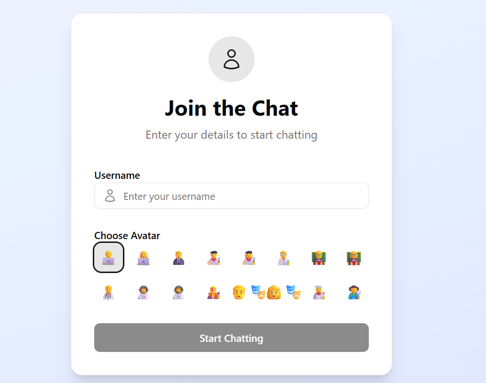
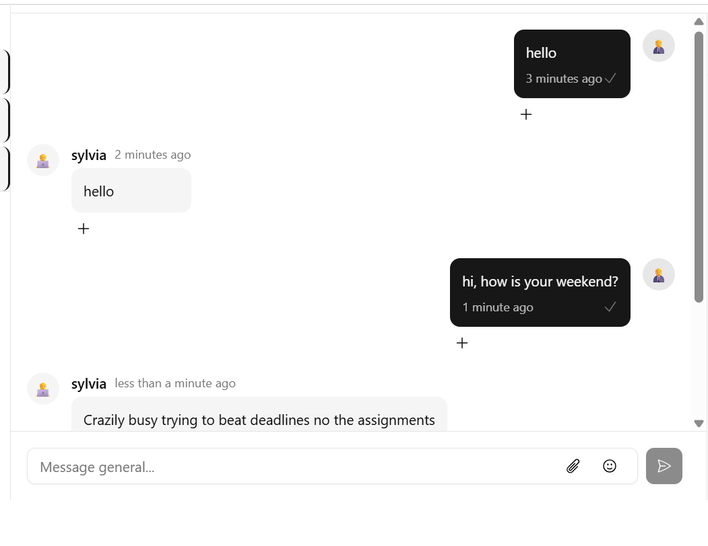
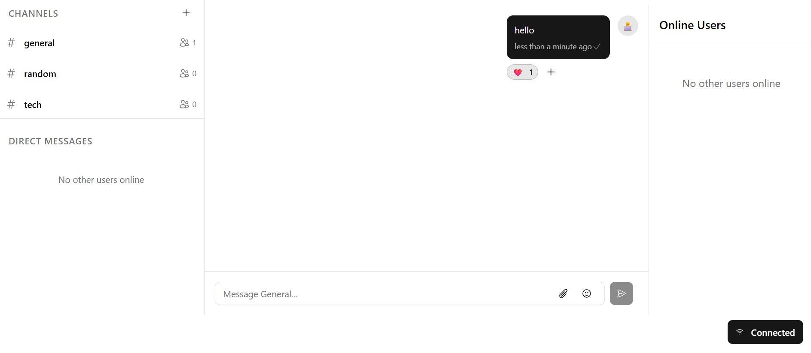

# Real-Time Chat Application

## Project Overview

This project is a real-time chat application built with Node.js, Express, and Socket.IO for the backend, and a modern JavaScript frontend (Vite, React, or similar). Users can join chat rooms, send messages, and see who is online. The app demonstrates real-time communication, user presence, and room management.

---

## Project Structure

```
week_5/
├── .gitignore
├── client/
│   ├── .env
│   ├── .gitignore
│   ├── components.json
│   ├── eslint.config.js
│   ├── index.html
│   ├── jsconfig.json
│   ├── package.json
│   ├── pnpm-lock.yaml
│   ├── README.md
│   ├── vite.config.js
│   ├── node_modules/
│   ├── public/
│   └── src/
│       └── services/
│           └── api.js
├── server/
│   ├── .env
│   ├── package.json
│   ├── pnpm-lock.yaml
│   ├── server.js
│   ├── config/
│   ├── controllers/
│   │   ├── authController.js
│   │   ├── messageController.js
│   │   ├── roomController.js
│   │   └── userController.js
│   ├── models/
│   │   └── inMemoryStore.js
│   ├── node_modules/
│   ├── socket/
│   │   └── socketHandlers.js
│   └── utils/
└── README.md
```

---

## Setup Instructions

### Prerequisites

- [Node.js](https://nodejs.org/) (v16+ recommended)
- [npm](https://www.npmjs.com/) or [pnpm](https://pnpm.io/)

### Backend Setup

1. **Navigate to the server directory:**
   ```bash
   cd server
   ```

2. **Install dependencies:**
   ```bash
   npm install
   # or
   pnpm install
   ```

3. **Start the server:**
   ```bash
   npm start
   # or
   pnpm start
   ```
   The server will run on [http://localhost:3001](http://localhost:3001) by default.

### Frontend Setup

1. **Navigate to the client directory:**
   ```bash
   cd client
   ```

2. **Install dependencies:**
   ```bash
   npm install
   # or
   pnpm install
   ```

3. **Start the client:**
   ```bash
   npm run dev
   # or
   pnpm run dev
   ```
   The client will run on [http://localhost:5173](http://localhost:5173) (or similar, depending on your setup).

---

## Features Implemented

- **User Authentication:** Simple username and avatar selection.
- **Real-Time Messaging:** Send and receive messages instantly in chat rooms.
- **Room Management:** Join, leave, and create chat rooms.
- **User Presence:** See who is online in each room.
- **Last Seen:** Displays when a user was last online.
- **Graceful Disconnect:** Users are marked offline after a short delay if they disconnect.
- **Responsive UI:** Works on desktop and mobile browsers.

---

## Screenshots

### Login Screen


### Chat Room


### User List



---

## License

MIT

---

## Acknowledgements

- [Socket.IO](https://socket.io/)
- [Express](https://expressjs.com/)
- [React](https://react.dev/) (if used in frontend)
